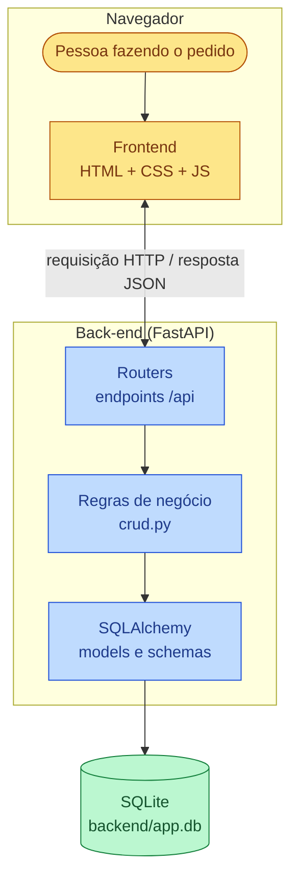

# Diagrama de fluxo do projeto

Visão geral de como as peças da Fase 1 se conectam: quem chama quem, do
clique na tela até a gravação no banco.

## Explicação

- A pessoa interage com o **frontend** no navegador.
- O frontend chama a **API** (`routers/`), que passa pelas **regras de
  negócio** (`crud.py`) antes de ler ou gravar no banco através do
  **SQLAlchemy** (`models.py` / `schemas.py`).
- A resposta volta em JSON e o frontend atualiza a tela, sem recarregar a
  página.
